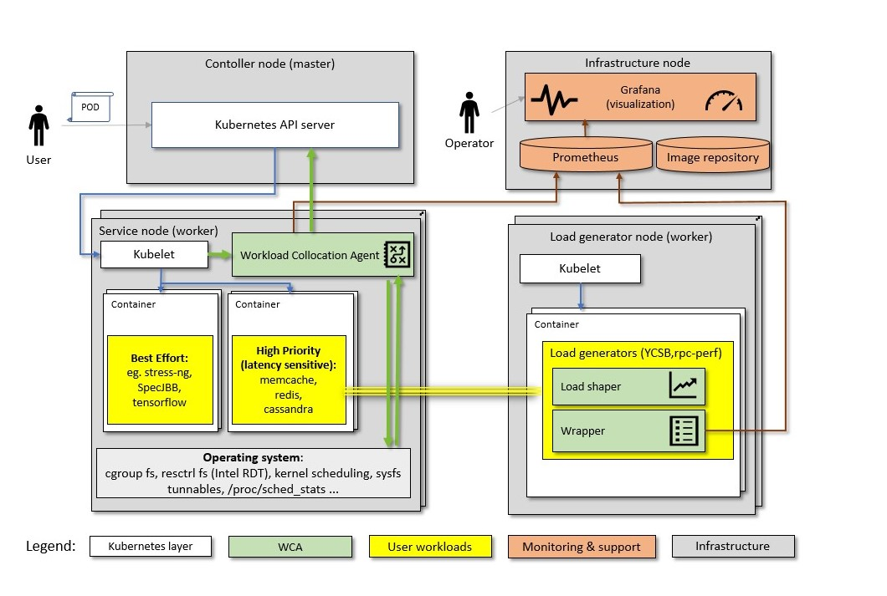

======================
Kubernetes integration
======================

**This software is pre-production and should not be deployed to production servers.**

.. contents:: Table of Contents

Introduction
============

The diagram below puts Kubernetes integration in context of a cluster and monitoring infrastructure:



Kubernetes supported features
=============================

- Monitoring
- Allocation


:Note: In allocation mode, because of Kubernetes internal reconcillation  loop for resource managment (`--sync-frequency <https://kubernetes.io/docs/reference/command-line-tools-reference/kubelet/>`_ defaults to 60s), it is required from Allocator class to repeat desired allocations in every iteration. This will be fixed in future versions.

Kubernetes restrictions
=======================

- Kubernetes version >= 1.13.x,
- cgroup driver: `systemd` or `cgroupfs`.

Possible wca configuration options
==================================
In wca configuration file one can set below listed parameters.
Please refer to `example configuration file for kubernetes <../configs/kubernetes/kubernetes_example_allocator.yaml>`_.


Getting started
===============
Reference configs are in `configuration file for kubernetes <../examples/kubernetes/monitoring>`_.

`example configuration file for kubernetes <../examples/kubernetes/monitoring/wca>`_
`example configuration file for kubernetes <../examples/kubernetes/monitoring/cadvisor>`_

Below instruction is about run wca as DaemonSet on cluster. This way uses kustomize to deploy all components.
Kustomize is available from kubectl 1.14.

1. Prepare cluster
Workload Collocation Agent required existing 'wca' namespace and label 'monitoring=wca' on nodes,
where it will be deployed.

Namespace and label can be crated by using kubectl by following commands:

.. code-block:: bash

    kubectl create namespace wca
    kubectl label nodes node100 node101 node102 monitoring=wca

Where names `node100 node101 node102` should be replaced by your kubernetes node names.
If you want deploy wca on all nodes, you can delete affinity in daemonset spec.


2. Build image(from main project repo) and push to your registry

Build `Docker image <../Dockerfile>`_ and push to private repo. You can use make command to this. Like in example below.
You have to replace DOCKER_REPOSITORY_URL variable to yours own docker registry.

.. code-block:: bash

    WCA_IMAGE=${DOCKER_REPOSITORY_URL}/wca
    WCA_TAG=master
    make wca_package_in_docker
    make _wca_docker_devel
    sudo docker build --network host --target standalone -f Dockerfile -t $WCA_IMAGE:$WCA_TAG .

    docker push $WCA_IMAGE:$WCA_TAG


3. Overwrite docker image name to your local repository in ../examples/kubernetes/monitoring/wca/kustomization.yaml

In kustomization.yaml, you can find field **images**. You have to replace DOCKER_REPOSITORY_URL variable to yours own docker registry.

```yaml
...
images:
  - name: wca
    newName: ${DOCKER_REPOSITORY_URL}/wca
    newTag: master
```

Note the default image (from **kustomization.yaml**) is using private repository in testing cluster and **master** tag.

4. Adjust the wca configuration
Workload Collocation Agent requires configuration file.
`Example config using by Daemonset <../examples/kubernetes/monitoring/wca/wca-config.yaml>`_.


`Here is an example config to run wca in allocator mode <../example/manifest/configmap.yaml>`_.


5. Deploy wca
Finally use the command below to deploy all wca components.

.. code-block:: bash

    kubectl apply -k ./examples/kubernetes/monitoring/wca


`README <../examples/kubernetes/monitoring/wca/README.md>`_ for more advance wca configuration.


Task's metrics labels for Kubernetes
====================================
Task metrics (e.g. cycles, cache_misses_per_kilo_instructions) have labels which are generated in the manner:

- pod's label sanitized (replaced '.' with '_'),
- additional label **task_name** which value is created by joining pod namespace and pod name (e.g. 'default/stress_ng'),
- additional label **task_id** which value is equal to pod identifier.


Task's resources for Kubernetes
===============================
List of available resources:

- disk
- mem
- cpus
- limits_mem
- limits_cpus
- requests_mem
- requests_cpus

Task resources "disk" and "mem" are scalar values expressed in bytes. Fractional "cpus" values correspond to partial shares of a CPU.
They are calculated from containers spec (https://kubernetes.io/docs/concepts/configuration/manage-compute-resources-container/#meaning-of-memory).
``limits_*`` and ``requests_*`` are added according to k8s documentation (https://kubernetes.io/docs/concepts/configuration/manage-compute-resources-container/#resource-requests-and-limits-of-pod-and-container).
